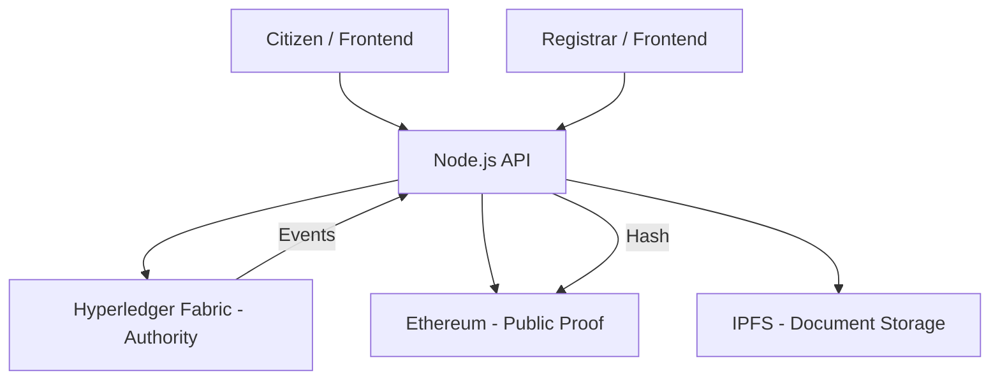

# BhoomiSetu: Architecture Overview

BhoomiSetu employs a hybrid blockchain architecture designed for the Indian land registry context, balancing authoritative governance with public transparency.

## Component Stack

- **Authority Blockchain**: Hyperledger Fabric
  - *Role*: Maintains the definitive record of land ownership and rights.
  - *Consensus*: Raft (distributed across government departments like Revenue, Registrar, and Land Records).
  - *Smart Contracts*: Chaincode implemented in TypeScript handling logic for ULPIN-based parcels and unit-level apartments.

- **Public Blockchain**: Ethereum (or Polygon)
  - *Role*: Provides immutable "proof of integrity" for the Fabric state.
  - *Mechanism*: Only cryptographic hashes of Fabric events (e.g., transfers, disputes) are anchored to Ethereum.
  - *Integrity*: Citizens can verify that the data in the government database (Fabric) has not been tampered with by comparing hashes with the public chain.

- **Orchestration Layer**: Node.js (TypeScript)
  - *Role*: Single point of interaction for frontend applications.
  - *Integration*: Connects to Fabric via Fabric SDK and Ethereum via Web3.js.
  - *Storage*: Handles document uploads to IPFS and anchors resulting CIDs on both blockchains.

- **Storage Layer**: IPFS
  - *Role*: Decentralized storage for heavy documents like Sale Deeds, Court Orders, and Survey Maps.

## System Flow

